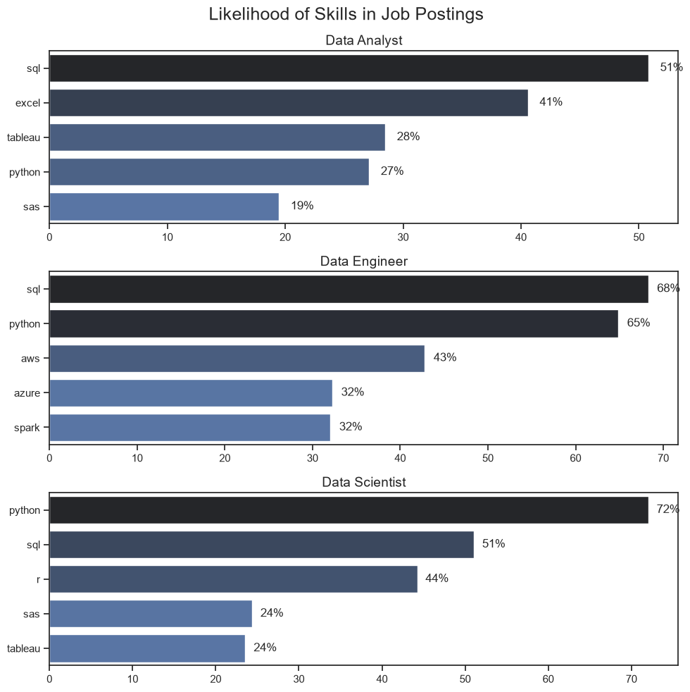
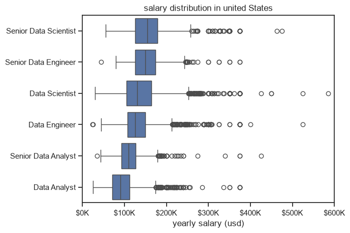
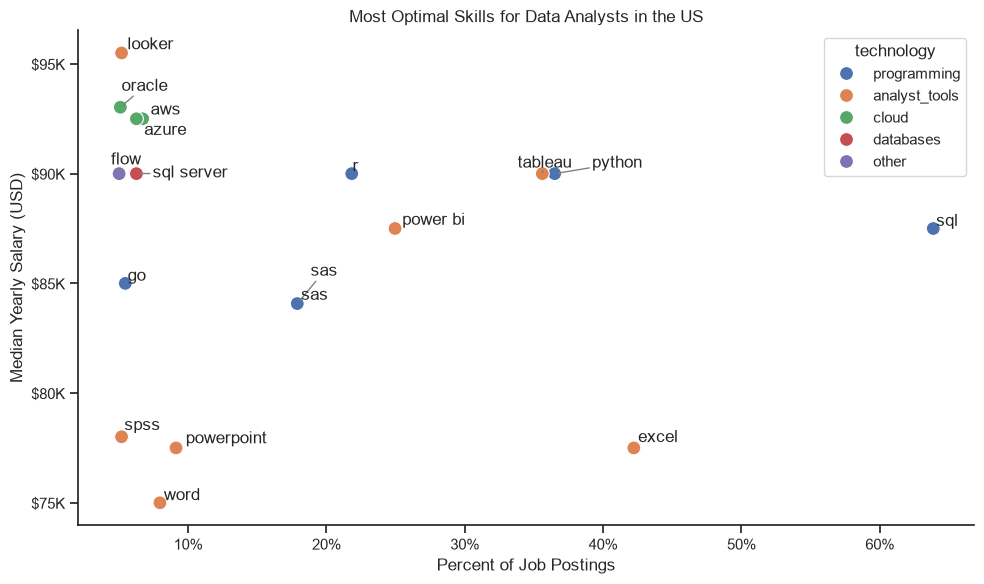

# 📊 Overview

Welcome to my Data Analyst Job Market Analysis project. This project explores the U.S. data job market to identify the most valuable skills, salary trends, and career opportunities for aspiring Data Analysts.

Using real-world job posting data, I analyzed hiring patterns, salary distributions, and skill demand to answer key career-related questions. The goal of this project is to help job seekers understand which skills are most valuable and how they influence salary and employment opportunities.

The analysis was performed using Python, leveraging libraries such as Pandas, Matplotlib, and Seaborn for data cleaning, exploration, and visualization.

# ❓ Project Questions

This project aims to answer the following questions:

- Which skills are most in demand for the top three data careers?
- How does skill demand change throughout the year for Data Analysts?
- How do salaries differ across popular data-related job titles?
- Which skills provide the best balance between market demand and salary for Data Analysts?

# 🛠️ Tools & Technologies

The following technologies were used throughout the project:

- Python – Primary programming language for data analysis.
- Pandas – Data cleaning, transformation, and analysis.
- Matplotlib – Data visualization.
- Seaborn – Statistical and advanced visualizations.
- Jupyter Notebook – Interactive data exploration and analysis.
- Visual Studio Code – Development environment.
- Git & GitHub – Version control and project management.

# 🧹 Data Preparation & Cleaning

Before beginning the analysis, the dataset was cleaned and transformed to ensure reliable results.

Data Preparation Steps
- Imported the dataset and required Python libraries.
- Converted job_posted_date to datetime format.
- Parsed the job_skills column into Python lists.
- Removed records with missing salary information where required.
- Filtered the dataset to focus on United States job postings.
- Created additional features such as posting month for trend analysis.

# 🔍 Project Analysis

The project is organized into four separate notebooks, each addressing a specific business question.

1️⃣ Most In-Demand Skills for the Top Data Roles

This analysis identifies the most frequently requested skills for the three most popular data careers:

- Data Analyst
- Data Engineer
- Data Scientist

The objective is to understand the technical skills employers prioritize for each role and compare the differences between career paths.

2️⃣ Skill Demand Trends Throughout the Year

This section analyzes how the demand for the top Data Analyst skills changes across different months.

The analysis helps identify:

- Seasonal hiring trends
- Skills with consistently high demand
- Emerging technologies gaining popularity throughout the year   

3️⃣ Salary Analysis of Data Roles

This notebook compares salary distributions across major data-related positions.

The analysis includes:

- Median salary comparison
- Salary spread using box plots
- Identification of high-paying roles
- Detection of salary outliers

The findings illustrate how specialization and experience influence compensation within the data industry.

4️⃣ Optimal Skills for Data Analysts

The final analysis combines job demand and median salary to determine which skills provide the highest return for aspiring Data Analysts.

Rather than focusing only on popularity or salary individually, this section identifies skills that maximize both career opportunities and earning potential.

# 📈 Key Findings
- SQL is the most universally required skill across all data roles.
- Python demand is highest in Data Science and Data Engineering positions.
- Excel remains an essential skill for business-focused Data Analyst roles.
- Cloud technologies (AWS and Azure) are increasingly valuable for technical positions.
- Data Scientists and Senior Data Engineers command the highest median salaries.
- SQL, Python, Tableau, and cloud technologies provide the strongest combination of demand and salary potential.


# The Analysis
## 1 . What are most demanded skills for the top 3 most popular data role?
TO find the most popular demanded skills for the top 3 most popular data roles. I filtered out those positions by which ones were the most poular and got the top 5 skills for these top 3 roles . This query highlights the most polular job_title and  their top skills ,showing which skill i should pay attention to depending on the role I am targeting.

view my notebook with detailed steps here:   
[2_skill_Demand.ipynb](project/2_skill_demand.ipynb)

### Visualize data   
``` python   
fig, ax = plt.subplots(len(job_titles), 1, figsize=(10, 10))

sns.set_theme(style='ticks')

for i, job_title in enumerate(job_titles):

    # Top 5 skills in descending order
    df_plot = (
        df_skills_perc[df_skills_perc['job_title_short'] == job_title]
        .sort_values(by='skill_percent', ascending=False)
        .head(5)
    )

    sns.barplot(
        data=df_plot,
        x='skill_percent',
        y='job_skills',
        hue='skill_count',
        palette='dark:b_r',
        legend=False,
        ax=ax[i]
    )

    ax[i].set_title(job_title, fontsize=14)
    ax[i].set_xlabel('')
    ax[i].set_ylabel('')

    # Add percentage labels
    for n, v in enumerate(df_plot['skill_percent']):
        ax[i].text(v + 1, n, f'{v:.0f}%', va='center')
    

fig.suptitle('Likelihood of Skills in Job Postings', fontsize=18)

plt.tight_layout()
plt.show()
```   
### Results   
  

## Insights:  
- Identified SQL as the most consistently demanded skill across Data Analyst (51%), Data Engineer (68%), and Data Scientist (51%) roles, highlighting its importance as the core competency for data professionals.
- Found that Python is highly valued in technical roles, appearing in 72% of Data Scientist and 65% of Data Engineer job postings, while demand is comparatively lower (27%) for Data Analysts.
- Observed that Excel remains a fundamental business analytics tool, with 41% of Data Analyst job postings requiring Excel proficiency.
Analyzed cloud technology demand and found AWS (43%) and Azure (32%) to be among the most requested skills for Data Engineering positions.
- Identified Spark (32%) as a key technology for Data Engineers, reflecting industry demand for large-scale data processing and distributed computing.
- Found that R (44%) continues to be a valuable programming language for Data Scientists, particularly for statistical analysis and research-oriented workflows.
- Observed steady demand for Tableau across analytical roles, demonstrating the importance of data visualization and dashboard development in business decision-making.  
### 📌 Overall Findings
- SQL is the most universally required skill across all data-related roles.
- Python demand increases significantly in Data Science and Data Engineering positions.
- Business-oriented roles prioritize Excel and Tableau, while engineering roles emphasize cloud platforms and big data technologies.
- A strong combination of SQL, Python, Excel, Tableau, AWS, and Spark aligns well with current industry hiring trends for data professionals..


# 2. How are in-demand skills trending for Data Analyst?   
### Visualize Data
``` python
import matplotlib.pyplot as plt
import seaborn as sns
from matplotlib.ticker import PercentFormatter

# Top 5 skills
df_plot = df_DA_US_perc.iloc[:, :5]

sns.set_theme(style="ticks")

fig, ax = plt.subplots(figsize=(10, 6))

sns.lineplot(
    data=df_plot,
    dashes=False,
    palette="tab10",
    linewidth=2,
    ax=ax
)

sns.despine()

ax.set_title("Trending Top Skills for Data Analysts in the US")
ax.set_xlabel("2023")
ax.set_ylabel("Likelihood in Job Posting")

# Format y-axis as percentages
ax.yaxis.set_major_formatter(PercentFormatter(decimals=0.1))

# Remove legend
if ax.get_legend() is not None:
    ax.get_legend().remove()

# Add a little space on the right
ax.set_xlim(-0.5, len(df_plot.index) - 0.2)

# Write skill names at the end of each line
for line, skill in zip(ax.lines, df_plot.columns):
    x = line.get_xdata()[-1]
    y = line.get_ydata()[-1]

    ax.annotate(
        skill,
        xy=(x, y),
        xytext=(8, 0),               # 8 points to the right
        textcoords="offset points",
        va="center",
        fontsize=11
    )

plt.tight_layout()
plt.show()
```
### Results  
[Trending top skills for data analysis in the US](images/image.png)    


*Bar graph visualizing the trending top skills for data analyst in the US in 2023.*

view my notebook with detailed steps here:  
[3_skill_trend.ipynb](project/3_skills_trend.ipynb)

### Insights  
- SQL remained the most requested Data Analyst skill across all months.
- Excel consistently ranked as the second most demanded skill.
- Python showed an upward trend toward the end of the year, indicating increasing demand for programming capabilities.
Tableau maintained stable demand throughout the year with minimal fluctuations.
- Power BI showed comparatively lower demand but remained relevant across the year.

#### Overall Finding

The analysis suggests that employers prioritize database querying (SQL), spreadsheet analysis (Excel), programming (Python), and data visualization (Tableau) as the primary competencies for Data Analyst roles.

# 3. How well do jobs and skills pay for Data Analyst?  
### Visualize data   
``` python
sns.boxplot(data=df_US_top6,x='salary_year_avg',y='job_title_short',order=job_order)
sns.set_theme(style='ticks')
# this is all the same
plt.title("salary distribution in united States")
plt.xlabel('yearly salary (usd)')
plt.ylabel('')
plt.xlim(0,600000)
ticks_x=plt.FuncFormatter(lambda y,pos:f'${int(y/1000)}K')
plt.gca().xaxis.set_major_formatter(ticks_x)
plt.show()
```
### results:

[salary_distribution for data jobs](images/result_3.png)    

*Box plot visualizing the salary distribution for top 6 data jobs Titles.*


view my notebook with detailed steps here: 
[salary_analysis.ipynb](project/4_salary_analysis.ipynb)

#### Insights:
- Identified a clear salary progression across data roles, with Senior Data Scientists and Senior Data Engineers earning the highest median salaries among the analyzed positions.
- Observed that senior-level positions consistently offer higher compensation than their corresponding mid-level roles, highlighting the financial value of experience and leadership.
- Found that Data Scientist roles generally command higher median salaries than Data Analyst roles, reflecting the premium placed on machine learning and advanced analytical expertise.
- Analyzed salary variability using box plots and found that Data Scientist and Data Engineer roles exhibit a wider salary distribution, indicating greater differences in compensation across industries, locations, and experience levels.
- Identified numerous high-salary outliers (exceeding $300K, with some approaching $600K), suggesting that specialized skills, seniority, and employment at top-paying organizations can substantially increase earning potential.
- Observed that Data Analyst positions have the lowest salary range among the analyzed roles but still provide competitive compensation, making them a common entry point into data careers.  
### 📌 Overall Findings
- Salary generally increases with role seniority and technical specialization.
- Data Science and Data Engineering offer higher earning potential than Data Analytics roles.
- Wider salary distributions in technical roles indicate greater opportunities for high-income positions, particularly for professionals with advanced skills and experience.
- The presence of numerous high-paying outliers suggests that continuous skill development and specialization can significantly improve long-term salary potential.


# How well do jobs and skills pay for Data analyst role 
## highest paid and most demanded skills for Data analyst 
### results:   
in demand skills for data analysts in US:  
    
*Two seperate bar graphs visulazing the highest paid skills and most in demand skills for Data analyst in US.*
view my notebook with detailed steps here: 
[salary_analysis.ipynb](project/4_salary_analysis.ipynb)   

# 5_What is the most optimal skill to learn for Data Analyst?  

### visualize data
```python
from adjustText import adjust_text

sns.set_theme(style='ticks')
plt.figure(figsize=(10, 6))

# correct column names and use string for hue
sns.scatterplot(
    data=df_plot,
    x='skills_percent',
    y='median_salary',
    hue='technology',
    s=100
)
sns.despine()

texts = []
# annotate using df_plot rows (skills column contains the skill name)
for i, row in df_plot.iterrows():
    texts.append(
        plt.text(
            row['skills_percent'],
            row['median_salary'],
            row['skills']
        )
    )

adjust_text(
    texts,
    arrowprops=dict(arrowstyle='->', color='gray')
)

plt.xlabel('Percent of Job Postings')
plt.ylabel('Median Yearly Salary (USD)')
plt.title('Most Optimal Skills for Data Analysts in the US')

from matplotlib.ticker import PercentFormatter

ax = plt.gca()
# x values are percentages (0-100), so set xmax=100
ax.xaxis.set_major_formatter(PercentFormatter(xmax=100))
ax.yaxis.set_major_formatter(
    plt.FuncFormatter(lambda y, pos: f'${int(y/1000)}K')
)

plt.tight_layout()
plt.show()
``` 
 
*A scatter plot visualizing for most optimal skill for Data analyst.*
view my notebook for detail:  
[optimal_skill.ipynb](project/5_most_optimal_skill.ipynb)    

### Insights:   
- Identified SQL as the most optimal skill for Data Analysts, combining the highest demand (≈64%) with a competitive median salary (~$87K), making it the highest-return skill for job seekers.
- Found that Python and Tableau provide an excellent balance between market demand (≈36–37%) and salary (≈$90K), making them valuable complementary skills for Data Analyst roles.
- Observed that Excel is one of the most frequently requested skills (≈42%) but offers a comparatively lower median salary (~$77K), indicating it is a baseline requirement rather than a salary differentiator.
- Identified cloud technologies such as AWS and Azure as high-paying skills (above $92K) despite relatively low demand (below 10%), suggesting strong earning potential for analysts with cloud expertise.
- Found that Looker offers the highest median salary (≈$95K) among the analyzed skills, although it appears in a relatively small percentage of job postings, indicating a specialized but highly rewarding niche.
- Observed that Power BI provides a balanced combination of moderate demand (≈25%) and strong salary (~$88K), making it a valuable visualization tool for Data Analysts.
- Identified programming languages such as R and Go as niche skills with above-average salaries but lower demand compared to SQL and Python.


# 📚 What I Learned

This project strengthened both my technical and analytical skills by working with a real-world job market dataset. It provided hands-on experience in data cleaning, exploratory data analysis (EDA), visualization, and extracting actionable insights from data.

During this project, I learned:

- Data Cleaning & Preparation: Improved my ability to clean, transform, and prepare raw datasets using Pandas, including handling missing values, converting data types, and reshaping data for analysis.
- Exploratory Data Analysis (EDA): Developed skills in identifying trends, patterns, and relationships through descriptive statistics and visual exploration.
- Data Visualization: Gained practical experience creating effective visualizations using Matplotlib and Seaborn to communicate insights clearly and support data-driven decisions.
- Market-Driven Analysis: Learned how to combine multiple metrics such as skill demand, salary, and hiring trends to evaluate the current data job market.
-Python for Data Analysis: Strengthened my proficiency in Python by applying libraries such as Pandas, NumPy, Matplotlib, and Seaborn to solve real-world analytical problems.

# 💡 Insights

- This project uncovered several important trends in the U.S. data job market by analyzing skill demand, salary distributions, and hiring patterns.

- Demand and salary do not always move together. While foundational skills like SQL appear in the largest number of job postings, specialized skills such as AWS, Looker, and Oracle often command higher salaries despite lower demand.
- Technical specialization leads to higher earning potential. Roles requiring programming, cloud computing, and machine learning skills generally offer higher salaries than business-focused analytical roles.
- Career paths require different skill sets. Data Analysts emphasize SQL, Excel, and visualization tools, whereas Data Engineers and Data Scientists require stronger programming, cloud, and big data technologies.
- Continuous learning is essential. The demand for modern technologies such as Python, cloud platforms, and distributed computing demonstrates that keeping technical skills up to date is critical for long-term career growth.
# 🚧 Challenges Faced

Working with a real-world dataset presented several challenges that helped strengthen my data analysis skills.

- Data Cleaning: The dataset contained missing salary values and inconsistent formats that required preprocessing before analysis.
- Data Transformation: Converting nested skill lists, handling datetime fields, and reshaping the data for trend analysis required extensive use of Pandas operations.
- Visualization Design: Selecting appropriate chart types and presenting insights clearly while avoiding clutter required multiple iterations and refinements.
- Interpreting Results: Distinguishing between highly demanded skills and highly paid skills required combining multiple analyses to draw meaningful conclusions rather than relying on a single metric.
# 🎯 Conclusion

- This project provided valuable insights into the U.S. data job market by examining skill demand, salary trends, and hiring patterns for Data Analyst, Data Engineer, and Data Scientist roles.

- The analysis demonstrates that SQL remains the most fundamental skill across all data careers, while Python, cloud technologies, and business intelligence tools significantly enhance career opportunities and earning potential. It also highlights that salary is influenced not only by demand but also by the level of technical specialization required.

- Beyond the business insights, this project strengthened my practical experience in data cleaning, exploratory data analysis (EDA), data visualization, and communicating findings through data storytelling. These skills are directly applicable to real-world Data Analyst and Business Intelligence roles and provide a solid foundation for more advanced analytics projects.
